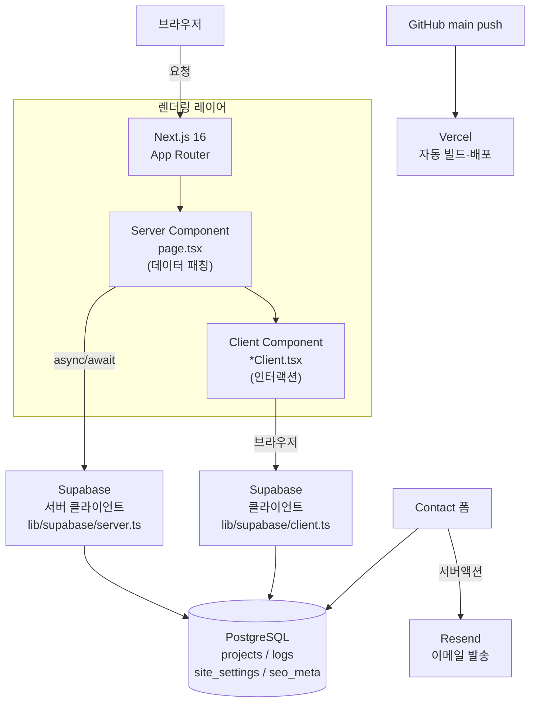

# HUNI² — 포트폴리오 & Dev Log

허창훈의 포트폴리오 사이트. 프로젝트 카드, 수치화된 임팩트, 마크다운 Dev Log, Admin CMS, i18n, 다크/라이트 테마.

**Live:** https://huni2-popol.vercel.app

---

## 핵심 기능 — CMS 기반 자동 이력서 PDF

**이 사이트의 가장 큰 차별점은 이력서가 따로 존재하지 않는다는 것이다.**

Admin 패널에서 프로젝트 설명과 임팩트 수치를 업데이트하면, `/resume` 페이지가 같은 DB에서 데이터를 끌어와 인쇄 최적화 레이아웃으로 렌더링한다. "이력서 PDF" 버튼을 누르면 브라우저가 그 페이지를 PDF로 변환한다.

```
Admin 패널에서 수정
  → Supabase DB 반영
  → /resume 페이지가 최신 데이터 렌더링
  → 브라우저 인쇄(Ctrl+P) → PDF 저장
```

별도 디자인 툴 없이, 포트폴리오 사이트를 운영하는 것만으로 이력서가 항상 최신 상태로 유지된다.

---

## 문제 → 선택 → 결과

**문제.** 포트폴리오를 정적 HTML이나 Notion으로 만들면 콘텐츠를 업데이트할 때마다 코드를 건드려야 한다. 프로젝트 설명, 임팩트 수치, 블로그 글을 배포 없이 관리하고 싶었다.

**선택.** Supabase를 CMS 백엔드로, Next.js 16 App Router를 렌더링 레이어로 선택했다. 서버 컴포넌트가 직접 DB를 조회하므로 API 레이어가 필요 없다. Admin 패널에서 콘텐츠를 수정하면 다음 요청부터 반영된다.

**결과.** 배포 없이 Admin 패널에서 프로젝트 설명, 임팩트 수치, About/Contact/SEO를 모두 관리. 코드 없는 CMS 수준의 운영 편의성에 Next.js의 렌더링 성능을 함께 확보.

---

## 기술 스택 & 선택 이유

| 기술 | 버전 | 선택 이유 |
|------|------|-----------|
| **Next.js** | 16 (App Router) | 서버 컴포넌트가 Supabase를 직접 호출 → API 레이어 불필요. Turbopack으로 빠른 로컬 개발 |
| **Supabase** | latest | PostgreSQL + Auth + Storage를 하나로. Admin Row Level Security로 패널 접근 제어. `service_role` 키로 서버사이드에서 RLS 우회 가능 |
| **Tailwind CSS** | v4 | `@theme` 블록에서 CSS 변수로 토큰 정의. `tailwind.config.js` 없이 `globals.css` 하나로 관리 |
| **DaisyUI** | v5 | `data-theme` 속성으로 다크/라이트 전환. 시맨틱 색상(`base-100`, `primary` 등)이 테마에 자동 반응 |
| **Framer Motion** | latest | 벤토 그리드 카드 hover 애니메이션, 포트폴리오 목록 layout 전환을 선언형으로 처리 |
| **react-markdown + shiki** | latest | 마크다운 렌더링 + 코드 블록 문법 강조. rehype-pretty-code로 shiki 테마 적용 |
| **Resend** | latest | Contact 폼 이메일 발송. Vercel Edge와 궁합이 좋고 무료 티어로 충분 |
| **Vercel** | - | Next.js 공식 호스팅. `main` 푸시 → 자동 빌드·배포 |

---

## 아키텍처



---

## 프로젝트 구조

```
hunipopol/
├── app/                        # Next.js App Router
│   ├── layout.tsx              # 루트 레이아웃 (테마, i18n, Header)
│   ├── page.tsx                # 홈 (벤토 그리드)
│   ├── about/page.tsx
│   ├── contact/page.tsx
│   ├── portfolio/page.tsx      # 프로젝트 카드 + Impact 탭
│   ├── log/
│   │   ├── page.tsx            # Dev Log 목록 (프로젝트 필터)
│   │   └── [slug]/page.tsx     # 마크다운 상세
│   ├── resume/page.tsx         # 인쇄 최적화 이력서
│   └── admin/                  # CMS 패널 (Supabase Auth 보호)
│       ├── about/page.tsx
│       ├── portfolio/page.tsx
│       ├── logs/page.tsx
│       ├── contact/page.tsx
│       └── seo/page.tsx
│
├── components/
│   ├── home/HomeClient.tsx     # 벤토 그리드 + 마우스 빛 반사
│   ├── portfolio/PortfolioClient.tsx  # 프로젝트 카드 + Impact 탭
│   ├── log/LogListClient.tsx   # 로그 목록 + 프로젝트 필터
│   ├── layout/Header.tsx
│   └── admin/Editor.tsx        # 마크다운 에디터
│
├── lib/
│   ├── supabase/
│   │   ├── server.ts           # 서버 컴포넌트용 (service_role)
│   │   └── client.ts           # 클라이언트 컴포넌트용
│   ├── i18n.tsx                # useTranslation 훅 (ko / en)
│   └── theme.tsx               # DaisyUI data-theme 관리
│
├── supabase/
│   ├── schema.sql              # 테이블 정의
│   └── seed_company_projects.sql
│
└── scripts/
    ├── seed_projects.mjs       # 프로젝트 + 아키텍처 로그 시딩
    ├── seed_logs.mjs           # Dev Log 시딩
    └── seed_impact.mjs         # Impact 수치 시딩
```

---

## 핵심 패턴

### 서버/클라이언트 분리

```tsx
// app/portfolio/page.tsx — 서버 컴포넌트: DB 직접 조회
export default async function PortfolioPage() {
  const supabase = await createServerClient();
  const { data: projects } = await supabase.from('projects').select('*');
  return <PortfolioClient initialProjects={projects} />;
}

// components/portfolio/PortfolioClient.tsx — 클라이언트: 인터랙션 처리
'use client';
export default function PortfolioClient({ initialProjects }) {
  const [filter, setFilter] = useState('all');
  // ...
}
```

### Impact 수치 구조 (site_settings JSONB)

```json
{
  "key": "impact_stats",
  "value": [
    {
      "id": "rw-load-test",
      "project": "RoundWait",
      "metric": "99.94%",
      "title": "1만 명 예약 성공률",
      "before": "SLO 목표: ≥ 99%",
      "after": "99.94% 달성 — 평균 0.26초",
      "context": "마비노기 Fantasy Party 2026 k6 부하 테스트",
      "log_slug": "roundwait-10k-load-test"
    }
  ]
}
```

### i18n

```tsx
const { lang } = useI18n();
const label = lang === 'ko' ? '포트폴리오' : 'Portfolio';
```

---

## DB 스키마

```
portfolios / projects   — 프로젝트 카드 (title, description, tags, links, display_order)
logs                    — Dev Log (slug, title, content, tags, project, published)
site_settings           — JSONB 키-값 (impact_stats, about_bio, career_timeline ...)
seo_meta                — OG 메타 (og_title, og_description, og_image_url)
contact                 — Contact 폼 수신 메시지
```

---

## 로컬 개발

```bash
npm install
cp .env.local.example .env.local   # Supabase URL + keys 입력
npm run dev                         # Turbopack 개발 서버
npm run build                       # 프로덕션 빌드 확인
```

### 환경변수

| 변수 | 설명 |
|------|------|
| `NEXT_PUBLIC_SUPABASE_URL` | Supabase 프로젝트 URL |
| `NEXT_PUBLIC_SUPABASE_ANON_KEY` | 클라이언트용 공개 키 |
| `SUPABASE_SERVICE_ROLE_KEY` | 서버 전용 (RLS 우회) |
| `RESEND_API_KEY` | Contact 폼 이메일 발송 |

### 시드 스크립트

```bash
node --env-file=.env.local scripts/seed_projects.mjs   # 프로젝트 + 아키텍처 로그
node --env-file=.env.local scripts/seed_logs.mjs        # Dev Log
node --env-file=.env.local scripts/seed_impact.mjs      # Impact 수치
```

---

## 배포

`main` 브랜치 push → Vercel 자동 빌드·배포.

```
develop 브랜치에서 작업
  → PR 또는 직접 merge → main
  → Vercel 빌드 시작 (~1분)
  → https://huni2-popol.vercel.app 반영
```

---

## License

Private — All rights reserved. © 2026 허창훈
